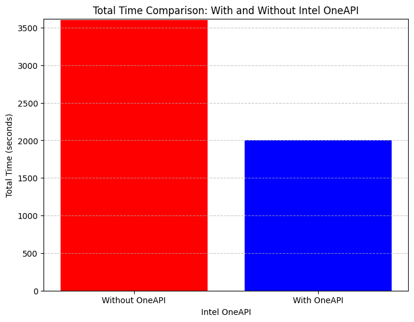
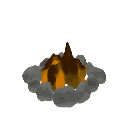
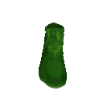

# PixelForge_GenAI

 

# PixelForge_GenAI

This project focuses on the generation of 3D shapes from both images and text inputs. It leverages cutting-edge techniques in generative modeling, including diffusion models for image-to-shape conversion and transformer-based models for text-to-shape conversion.

# Image-to-3D Model:
The image-to-3D model utilizes diffusion models, which are a class of generative models capable of generating high-quality images by iteratively diffusing noise into a latent space. By sampling latent vectors from the diffusion process and decoding them using pre-trained models, this approach can generate 3D shapes corresponding to input images. This method is useful for tasks such as converting 2D images of objects into detailed 3D representations.

# Text-to-3D Model:
The text-to-3D model employs transformer-based models, which are powerful neural network architectures commonly used for natural language processing tasks. By converting text descriptions into latent vectors and decoding them into 3D shapes, this approach enables the generation of 3D objects based on textual input. This capability is valuable for applications like generating 3D models from textual descriptions or incorporating textual descriptions into 3D scene generation pipelines.

# About:
This project aims to bridge the gap between different modalities of input data (images and text) and 3D shape generation. By combining state-of-the-art techniques in generative modeling with advancements in computer vision and natural language processing, it provides a flexible and powerful framework for creating 3D shapes from diverse sources of input.

Key Features:
Modality Integration: Supports both image and text inputs for generating 3D shapes, allowing users to choose the input modality that best suits their requirements.

State-of-the-Art Techniques: Utilizes diffusion models for image-to-3D conversion and transformer-based models for text-to-3D conversion, ensuring high-quality and diverse shape generation.

Open-Source: The project is open-source, enabling collaboration, experimentation, and further development by the research community and practitioners.

Potential Applications:
Content Creation: Artists and designers can use the models to quickly generate 3D shapes based on reference images or textual descriptions, speeding up the content creation process for various media.

Virtual Environment Generation: Developers of virtual reality (VR) and augmented reality (AR) applications can leverage the models to populate virtual environments with realistic 3D objects based on textual descriptions or real-world images.

Research and Education: Researchers and educators can explore the capabilities of generative modeling techniques and their applications in 3D shape generation, advancing the state of the art and disseminating knowledge in the field.

# Prerequisites
* Python 3.6+
* PyTorch
* Torch XLA
* NumPy
* Hugging Face Latent Diffusion(image Synthesis)
* SHAP-E library
* Intel oneAPI PyTorch library (intel-pytorch-extension)

* Importing Libraries: The script imports necessary libraries including **Intel PyTorch**, Torch XLA for distributed training support on TPU devices, NumPy, and various modules from the SHAP-E library.

* Importing Intel oneAPI Libraries: This section imports Intel oneAPI libraries for optimizations.

Checking PyTorch Device: It checks if PyTorch is using CUDA, typically indicating GPU acceleration.

Loading Model and Configuration: The script loads a pre-trained model ('transmitter' and 'image300M') along with its diffusion configuration.

Defining Batch Size and Guidance Scale: Batch size and guidance scale are defined for the generation process.

Loading and Preprocessing Image: An image of a corgi is loaded and preprocessed.

Sampling Latents: Latents are sampled from the model using the provided image. Various arguments control the sampling process such as batch size, model, diffusion, guidance scale, etc.

Choosing Rendering Mode and Size: The script selects a rendering mode ('nerf') and size (64) for rendering the images.

Creating Cameras: Cameras are created based on the chosen size and device.

Decoding Latent Images and Displaying Results: The script iterates over the sampled latent representations, decodes them into images using the specified rendering mode, and displays the results as a gif widget.

# HOW OneAPI and Devcloud Helped 

* **The project now integrates Intel oneAPI libraries alongside PyTorch**, **leveraging the computational power of Intel's hardware**. By utilizing oneAPI libraries on the PyTorch DevCloud, the code benefits from optimized performance and efficient execution. Additionally, the inclusion of Hugging Face's latent model enhances the project's capabilities, allowing for advanced processing of textual inputs. The integration of Intel oneAPI showcases a commitment to maximizing computational efficiency, ensuring that the models run seamlessly on Intel architecture. This combination of cutting-edge technologies empowers users to generate high-quality 3D shapes from images and text with improved speed and accuracy.
## Comparison Graph

# Samples

Here are some highlighted samples from our text-conditional model. For random samples on selected prompts, see [samples.md](samples.md).

<table>
    <tbody>
        <tr>
            <td align="center">
                
            </td>
            <td align="center">
                
            </td align="center">
            <td align="center">
                
            </td>
        </tr>
        <tr>
            <td align="center">A camp fire </td>
            <td align="center">A green boot</td>
            <td align="center">A spaceship</td>
        </tr>
    </tbody>
<table>

# MODELS

* [sample_text_to_3d.ipynb](PixelForge_GenAI/examples/sample_text_to_3d.ipynb) - sample a 3D model, conditioned on a text prompt.
* [sample_image_to_3d.ipynb](PixelForge_GenAI/examples/sample_image_to_3d.ipynb) - sample a 3D model, conditioned on a synthetic view image. To get the best result, you should remove background from the input image.
* [encode_model.ipynb](PixelForge_GenAI/examples/encode_model.ipynb) - loads a 3D model or a trimesh, creates a batch of multiview renders and a point cloud, encodes them into a latent, and renders it back. For this to work, install Blender version 3.3.1 or higher, and set the environment variable `BLENDER_PATH` to the path of the Blender executable.
